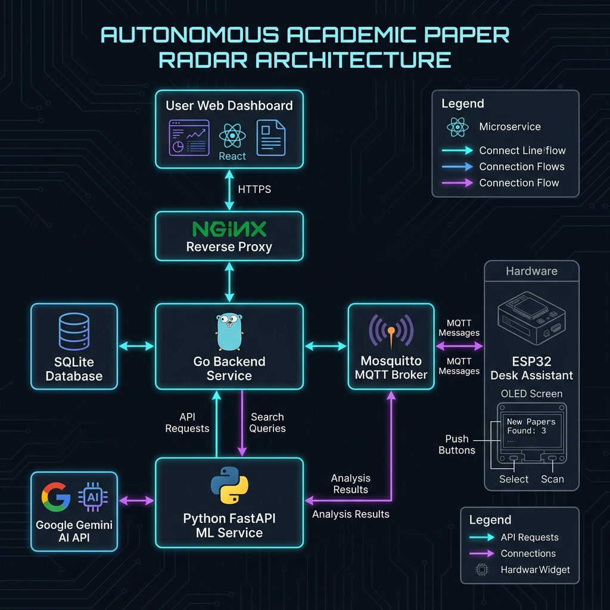
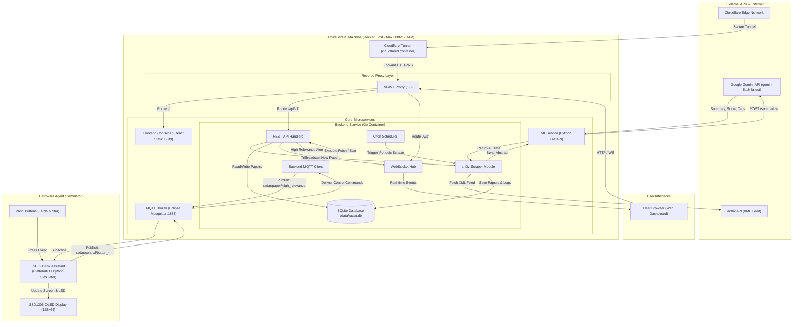

# Product Requirement Document (PRD) & System Specification
## Project Name: Autonomous Academic Paper Radar (with ESP32 Desk Assistant)

---

### 1. Project Overview & Objective
This project is an **Autonomous Academic Paper Scraper, Summarizer, and Dashboard** tailored for researchers and engineers. The system periodically fetches research papers from the **arXiv API** based on configured keywords (e.g., `swarm robotics`, `decentralized control`, `drone vtol`), processes abstracts using the **Google Gemini API** to generate 3-sentence summaries and relevance scores, stores them in a **SQLite database**, and displays them on a **React-based Web Dashboard**. Additionally, an **ESP32 Microcontroller** serves as a physical desktop widget with an OLED screen and push buttons for real-time paper alerts and manual action triggers via **MQTT**.

The entire application runs as lightweight Docker microservices on a cloud VM with strict memory constraints (**1 GB total RAM**).

---

### 2. System Architecture & Resource Constraints

#### Target Server
* **OS:** Ubuntu Linux (Azure Virtual Machine)
* **Resource Limit:** 1 GB RAM (Total Docker memory usage must stay under **300 MB**).

#### System Architecture Diagram





#### Microservices Stack
1. **Frontend Service (`frontend/`):** React.js (Vite) + Tailwind CSS + Lucide Icons. Served as static files via NGINX.
2. **Backend Service (`backend/`):** Go (Golang) REST API, WebSocket server, Cron Scheduler, and MQTT Client.
3. **ML / Gemini Service (`ml-service/`):** Python (FastAPI) or Go bridge connecting to Google Gemini API for paper summarization and relevance scoring.
4. **Broker Service (`broker/`):** Eclipse Mosquitto MQTT Broker (Port `1883`).
5. **Database Service (`db/`):** SQLite (Embedded persistent volume on backend).
6. **Reverse Proxy (`nginx/`):** NGINX for routing frontend assets (`/`), API endpoints (`/api`), and WebSocket connections (`/ws`).
7. **Cloud Tunnel (`cloudflared/`):** Cloudflare Tunnel container for secure HTTPS access.
8. **Hardware Agent (`esp32/`):** ESP32 Microcontroller (C++/Arduino/PlatformIO) + SSD1306 OLED Display (128x64) + 2x Tactile Push Buttons.

---

### 3. Repository Directory Structure
An AI agent should construct the workspace following this exact directory layout:

paper-radar/
├── PRD.md
├── docker-compose.yml
├── .env.example
├── nginx/
│   └── default.conf
├── mosquitto/
│   └── config/
│       └── mosquitto.conf
├── backend/
│   ├── Dockerfile
│   ├── main.go
│   ├── go.mod
│   ├── internal/
│   │   ├── arxiv/        # Scraper logic for arXiv API
│   │   ├── database/     # SQLite migrations & queries
│   │   ├── mqtt/         # MQTT Client handlers
│   │   ├── websocket/    # Hub & Client WS connections
│   │   └── handlers/     # REST API HTTP handlers
├── ml-service/
│   ├── Dockerfile
│   ├── main.py
│   ├── requirements.txt
│   └── gemini_client.py  # Gemini API integration & prompt builder
├── frontend/
│   ├── Dockerfile
│   ├── package.json
│   ├── vite.config.js
│   ├── src/
│   │   ├── App.jsx
│   │   ├── components/   # PaperCard, Header, FilterBar, Stats
│   │   └── services/     # API & WebSocket client
└── esp32/
    ├── platformio.ini
    └── src/
        └── main.cpp      # WiFi, MQTT, OLED Driver, Button Interrupts

---

### 4. Detailed Component Specifications

#### A. Database Schema (SQLite)
File location: `/data/radar.db` (Mounted Volume)

CREATE TABLE IF NOT EXISTS papers (
    id TEXT PRIMARY KEY,             -- e.g., arxiv_id "2408.01234"
    title TEXT NOT NULL,
    authors TEXT NOT NULL,           -- JSON array string or comma separated
    summary_raw TEXT NOT NULL,       -- Original abstract
    summary_ai TEXT,                 -- 3-sentence summary generated by Gemini
    relevance_score INTEGER DEFAULT 0, -- 0 to 100
    tags TEXT,                       -- JSON array e.g., ["#control", "#uav"]
    pdf_url TEXT NOT NULL,
    published_at DATETIME NOT NULL,
    is_starred BOOLEAN DEFAULT 0,
    is_read BOOLEAN DEFAULT 0,
    created_at DATETIME DEFAULT CURRENT_TIMESTAMP
);

CREATE TABLE IF NOT EXISTS system_logs (
    id INTEGER PRIMARY KEY AUTOINCREMENT,
    event TEXT NOT NULL,
    created_at DATETIME DEFAULT CURRENT_TIMESTAMP
);

#### B. API Specifications (Backend Service)
Base URL: `/api/v1`

- GET `/papers`: Get list of papers (Params: `page`, `limit`, `search`, `starred_only`, `min_score`)
- GET `/papers/:id`: Get single paper detail
- PATCH `/papers/:id/star`: Toggle star/favorite status (`{"is_starred": true}`)
- PATCH `/papers/:id/read`: Toggle read status (`{"is_read": true}`)
- POST `/trigger-fetch`: Manually trigger arXiv fetch (`{"keywords": "swarm control"}`)
- GET `/stats`: System summary statistics (Returns total papers, avg score, unread count)
- WS `/ws`: WebSocket endpoint (Stream real-time events: new paper alert, ESP32 status)

#### C. ML / Gemini Service Specification
* **Endpoint:** `POST http://ml-service:5000/summarize`
* **Input Payload:**
  {
    "arxiv_id": "2408.01234",
    "title": "Decentralized Swarm Robot Control under Wind Disturbances",
    "abstract": "Full abstract text here..."
  }
* **Gemini System Prompt Rules:**
  1. Act as a research paper reviewer.
  2. Produce a concise **3-sentence summary**: (Sentence 1: Core Problem, Sentence 2: Proposed Method, Sentence 3: Key Result).
  3. Assign a **Relevance Score (0 - 100)** based on relevance to autonomous systems, UAVs, swarm robotics, and control engineering.
  4. Generate 2 to 4 hashtag topics.
* **Output Payload (JSON):**
  {
    "summary_ai": "This paper addresses swarm drift in high-wind conditions. The authors propose a decentralized consensus algorithm using dynamic gain adjustment. Experimental results show a 35% reduction in positional error.",
    "relevance_score": 92,
    "tags": ["#swarm-robotics", "#decentralized-control", "#wind-rejection"]
  }

#### D. MQTT Topic Protocol
* **Broker:** Mosquitto (`broker:1883`)

1. **`radar/paper/high_relevance`** (Published by Backend -> Subscribed by ESP32)
   * **Payload:** `{"id": "2408.01234", "title": "Decentralized Swarm...", "score": 95}`
   * **Action:** ESP32 triggers OLED display update & LED blink.

2. **`radar/control/button_fetch`** (Published by ESP32 -> Subscribed by Backend)
   * **Payload:** `{"action": "FETCH_NOW", "timestamp": 1723000000}`
   * **Action:** Backend triggers immediate arXiv scraping job.

3. **`radar/control/button_star`** (Published by ESP32 -> Subscribed by Backend)
   * **Payload:** `{"action": "STAR_CURRENT", "paper_id": "2408.01234"}`
   * **Action:** Backend marks the current displayed paper as starred.

---

### 5. Docker Compose & Resource Management Configuration

To run safely within the **1 GB RAM limit**, use the following strict limits in `docker-compose.yml`:

version: '3.8'

services:
  cloudflared:
    image: cloudflare/cloudflared:latest
    command: tunnel --no-autoupdate run --token ${CLOUDFLARE_TOKEN}
    restart: unless-stopped
    deploy:
      resources:
        limits:
          memory: 30M

  nginx:
    image: nginx:alpine
    ports:
      - "80:80"
    volumes:
      - ./nginx/default.conf:/etc/nginx/conf.d/default.conf:ro
    depends_on:
      - frontend
      - backend
    deploy:
      resources:
        limits:
          memory: 20M

  broker:
    image: eclipse-mosquitto:latest
    ports:
      - "1883:1883"
    volumes:
      - ./mosquitto/config/mosquitto.conf:/mosquitto/config/mosquitto.conf
    deploy:
      resources:
        limits:
          memory: 15M

  backend:
    build: ./backend
    environment:
      - DB_PATH=/data/radar.db
      - MQTT_BROKER=broker:1883
      - ML_SERVICE_URL=http://ml-service:5000/summarize
    volumes:
      - db_data:/data
    depends_on:
      - broker
      - ml-service
    deploy:
      resources:
        limits:
          memory: 80M

  ml-service:
    build: ./ml-service
    environment:
      - GEMINI_API_KEY=${GEMINI_API_KEY}
    deploy:
      resources:
        limits:
          memory: 100M

  frontend:
    build: ./frontend
    deploy:
      resources:
        limits:
          memory: 25M

volumes:
  db_data:

---

### 6. NGINX Reverse Proxy Configuration
File: `nginx/default.conf`

server {
    listen 80;

    # Frontend Static Assets
    location / {
        proxy_pass http://frontend:80;
        proxy_set_header Host $host;
        proxy_set_header X-Real-IP $remote_addr;
    }

    # Backend REST API
    location /api/ {
        proxy_pass http://backend:8080/;
        proxy_set_header Host $host;
        proxy_set_header X-Real-IP $remote_addr;
    }

    # Backend WebSocket
    location /ws {
        proxy_pass http://backend:8080/ws;
        proxy_http_version 1.1;
        proxy_set_header Upgrade $http_upgrade;
        proxy_set_header Connection "Upgrade";
        proxy_set_header Host $host;
    }
}

---

### 7. Implementation Plan for AI Coding Agent

When an AI Agent is instructed to implement this repository, execute the tasks in the following sequence:

- [ ] **Phase 1: Environment & Configs**
  * Create folder structure as specified in Section 3.
  * Generate `.env.example`, `docker-compose.yml`, `nginx/default.conf`, and `mosquitto/config/mosquitto.conf`.
- [ ] **Phase 2: Backend Service (Go)**
  * Initialize Go module in `backend/`.
  * Set up SQLite database connection and automigration scripts.
  * Implement arXiv XML API parser (`internal/arxiv`).
  * Implement HTTP REST handlers, WebSocket hub, and MQTT client.
- [ ] **Phase 3: ML / Gemini Service (Python)**
  * Create FastAPI app in `ml-service/`.
  * Implement Google Gemini API call with structured JSON prompt formatting.
- [ ] **Phase 4: Frontend Service (React)**
  * Create React Vite app with Tailwind CSS in `frontend/`.
  * Build Paper Feed, Search/Filter bar, Relevance Badge, and Star/Read toggles.
- [ ] **Phase 5: ESP32 Firmware**
  * Create PlatformIO C++ project for ESP32.
  * Configure WiFiManager, PubSubClient (MQTT), SSD1306Wire (OLED), and GPIO button interrupts.

---

### 8. Development, GitHub & Deployment Workflow

#### Workflow Infographic & Diagram


```mermaid
flowchart LR
    subgraph Laptop["1. Laptop Development (Windows)"]
        LocalCode["Kode & Test Lokal<br/>(Go, React, Python)"]
        DockerLocal["Docker Compose Lokal<br/>(http://localhost)"]
        Simulator["Python ESP32 Simulator<br/>(Testing tanpa hardware)"]
    end

    subgraph GitHubRepo["2. Version Control (GitHub)"]
        GitPush["git push origin main"]
    end

    subgraph AzureVM["3. Production Server (Azure VM)"]
        GitPull["git pull origin main"]
        DockerProd["Docker Compose Production<br/>(RAM < 300MB)"]
        Cloudflare["Cloudflare Tunnel<br/>(Domain HTTPS Publik)"]
    end

    subgraph HardwareESP["4. Desk Assistant (ESP32)"]
        PIO["PlatformIO Upload via USB"]
        WiFiMQTT["WiFi & Mosquitto MQTT Broker"]
    end

    LocalCode -->|1. Test & Build| DockerLocal
    LocalCode -->|2. Push Source Code| GitPush
    GitPush -->|3. Pull Code di Cloud| GitPull
    GitPull -->|4. Deploy Service| DockerProd
    DockerProd <--> Cloudflare

    LocalCode -->|5. Flash Firmware via USB| PIO
    PIO --> WiFiMQTT
    WiFiMQTT <-->|MQTT Protocol (Pub/Sub)| DockerProd
```

#### Rincian Alur Kerja (Step-by-Step)

1. **Local Development (Laptop Windows):**
   * Pengembang & AI Agent menulis/mengedit kode secara lokal.
   * Layanan dijalankan lokal via Docker Compose: `docker compose up -d --build` (`http://localhost`).
   * Pengujian MQTT & interaksi ESP32 dapat disimulasikan tanpa hardware fisik menggunakan script `python esp32/simulator.py` atau Widget Virtual ESP32 di Dashboard Web.

2. **Version Control (GitHub Repository):**
   * File `.gitignore` mengamankan rahasia (`.env`), file database (`/data/radar.db`), dan file build.
   * Kode didorong ke repository utama via `git push origin main`.

3. **Production Server Deployment (Azure Virtual Machine):**
   * Server Azure menarik pembaruan kode via `git pull origin main`.
   * Layanan di-deploy di server via `docker compose up -d --build` dengan batas RAM < 300 MB.
   * **Cloudflare Tunnel (`cloudflared`)** mengamankan akses luar ke domain HTTPS publik secara langsung tanpa perlu membuka port secara manual.

4. **ESP32 Microcontroller Setup & Connectivity:**
   * Firmware di-flash ke chip ESP32 dari laptop via USB menggunakan **PlatformIO (VS Code)**.
   * ESP32 tersambung ke jaringan WiFi dan terhubung ke Mosquitto MQTT Broker (port `1883`).
   * ESP32 menerima notifikasi paper baru via topik `radar/paper/high_relevance` (tampilan OLED + LED blink) dan mengirim perintah tombol manual (`FETCH_NOW` & `STAR_CURRENT`) via topik `radar/control/button_*`.